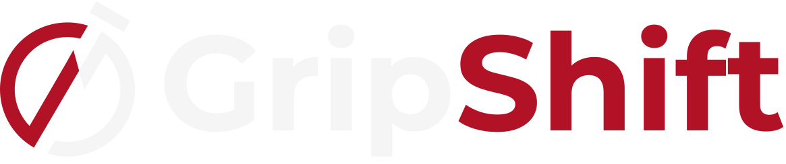

<div align="center">
  <div style="background-color: #0E0E0E; padding: 12px 20px; border-radius: 12px; display: inline-block;">
    
  </div>

**Master your guitar chord transitions — one minute at a time.**

  <p>
    <a href="LICENSE"></a>
    
    
    
  </p>

<a href="#-features">Features</a> •
<a href="#-how-it-works">How It Works</a> •
<a href="#-getting-started">Getting Started</a> •
<a href="#-contributing">Contributing</a> •
<a href="#-license">License</a>

</div>

GripShift is a **minimalist, open-source web application** designed to help guitar players build muscle memory and speed up chord transitions. Based on JustinGuitar's proven **"One Minute Changes"** exercise, it strips away all distractions — no ads, no sign-ups, no clutter. Just you, two chords, and 60 seconds.

▶️ [**Try It Live**](https://gripshift-app.vercel.app/)

---

## ✨ Features

| Feature                | Description                                                                        |
| ---------------------- | ---------------------------------------------------------------------------------- |
| **🎯 Chord Display**   | Two large, clearly colored chords centered on screen                               |
| **🔀 Randomizer**      | Randomly select from 25 predefined chord pairs — never repeats the same pair twice |
| **⏱️ 60-Second Timer** | Countdown display and progress bar                                                 |
| **3️⃣ Prep Countdown**  | 3-seconds countdown to prepare yourself before the timer starts                    |
| **🎮 Simple Controls** | Start/Pause toggle, Restart, and Change Chords                                     |
| **🌙 Dark Theme**      | Easy on the eyes, clean and focused interface                                      |
| **📱 Mobile-First**    | Fullscreen layout optimized for phones and practice on the go                      |
| **🚀 No Backend**      | Fully client-side — zero latency, zero sign-up, zero tracking                      |

---

## 🧠 How It Works

```
  1. OPEN the app         2. TAP Start            3. PRACTICE switching
     ┌─────┬─────┐           3... 2... 1...            between the two
     │  A  │  C  │           ┌────────────────┐        chords as fast and
     │     │     │           │  ⏵   ↺   🔀  │        cleanly as you can
     └─────┴─────┘           └────────────────┘
      01:00                   GO!
```

1. **Random Chord Pair:** The app shows two chords (e.g., A → C). Tap **Change Chords** to pick a new random pair.
2. **Start the Timer:** Press Play. A 3-second preparation countdown helps you get ready.
3. **Practice:** Switch between the two chords as many times as you can in 60 seconds. Count each clean transition.
4. **Track Progress:** Aim for 30+ transitions per minute. As you improve, challenge yourself with harder pairs.

---

## 🚀 Getting Started

### Installation

```bash
# Clone the repository
git clone git@github.com:l4ur4oliveira/gripshift.git
cd grip-shift

# Install dependencies
npm install

# Start the development server
npm run dev
```

Open [http://localhost:3000](http://localhost:3000) in your browser.

### Available Scripts

| Command         | Description              |
| --------------- | ------------------------ |
| `npm run dev`   | Start development server |
| `npm run build` | Build for production     |
| `npm start`     | Start production server  |
| `npm run lint`  | Run ESLint               |

---

## 📁 Project Structure

```
grip-shift/
├── docs/                    # Specifications
│   ├── SPEC-app.md          # Practice app spec
│   ├── SPEC-root.md         # Landing page spec
│   └── MIGRATION.md         # Vite → Next.js migration guide
├── public/
│   ├── hero-image.jpg       # Landing page preview
│   └── logo.svg             # Brand logo
├── src/
│   └── app/
│       ├── app/
│       │   └── page.jsx     # Practice app route (/app)
│       ├── globals.css      # Tailwind theme & global styles
│       ├── layout.jsx       # Root layout & metadata
│       └── page.jsx         # Landing page (/)
├── AGENTS.md                # AI agent instructions
├── next.config.js
├── package.json
└── README.md
```

---

## 🤝 Contributing

Contributions are welcome and appreciated! Here's how you can help:

### 🐛 Report a Bug

Open an [issue](https://github.com/l4ur4oliveira/gripshift/issues) with:

- A clear title and description
- Steps to reproduce
- Expected vs. actual behavior

### 💡 Suggest a Feature

Open an [issue](https://github.com/l4ur4oliveira/gripshift/issues) keeping in mind the MVP philosophy: simple, focused, distraction-free.

### 🛠 Submit a Pull Request

1. Fork the repository
2. Create a feature branch: `git checkout -b feat/my-feature`
3. Make your changes following the [specs](docs/)
4. Make sure the [specs](docs/) are up to date, and add new ones if needed
5. Run `npm run lint` to check code quality
6. Commit with a clear message: `git commit -m "feat: add my feature"`
7. Push: `git push origin feat/my-feature`
8. Open a Pull Request

### 📐 Guidelines

- Follow the existing code style (functional components, hooks, Tailwind)
- Keep changes minimal and focused — avoid feature creep
- Update docs/ specs if your change affects behavior
- Test on mobile viewport sizes
- Dark theme only

---

## 💚 Support

If **GripShift** helps you become a better guitar player, consider supporting my work!

Your support keeps the project alive, ad-free, and open source.

<a href="https://buymeacoffee.com/l4ur4oliveira">
  
</a>

---

## 📜 License

Distributed under the **MIT License**. See [LICENSE](LICENSE) for more information.

Copyright © 2026 [Laura de Oliveira](https://github.com/l4ur4oliveira)

---

### 🙏 Credits

- **Justin Sandercoe** ([JustinGuitar.com](https://www.justinguitar.com)) — for the "One Minute Changes" exercise that inspired this tool
- **Open Source community** — for the amazing tools that made this possible
